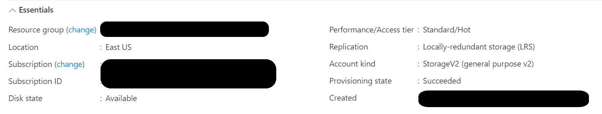
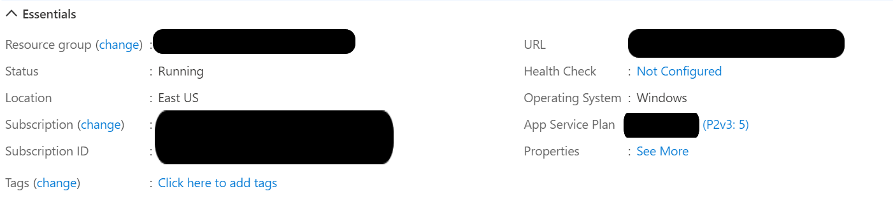
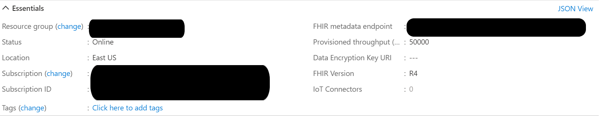

# Enhancing Performance of the FHIR Loader

The FHIR Loader deploys with a Standard App Service plan that can support tens of thousands file imports per hour.  During testing though we have been able to scale the Loader performance to hundreds of thousands of files per hour.  

Note:  Scaling to hundreds of thousands of files per hour requires additional scaling on the FHIR API to handle the incoming messages.  High rates of 429's at the API or Cosmos data plane indicate that additional scaling is necessary. 

## Conditions 
- _Load scaling and performance turning were done in several Azure Regions_
- _Load testing was created with [Synthea](https://github.com/synthetichealth/synthea) generator, each Patient had 1 year of data_ 
- _Load testing was measured with Patient only and Patient + Encounter bundles.  Patients only bundles performed marginally better_
- _Load testing zip (compressed-archive) bundles were limited to 300 resoruces to maintain queue depth, anything over 300 produced a growing delay for commits to the service bus_
- _For brevity, the FHIR Loader works with both the Azure API for FHIR and the Microsoft FHIR Server, this doc uses API for FHIR to represent both services_ 

## File Preparation 
The Loader will process files in several formats 
- _Bundles_ - Bundles are a collection of FHIR resources placed into a single file with containing context  
- _NDJSON_ - _a.k.a_ Newline delimited JSON, is a format for storing structured data that may be processed one record at a time
- _Zip_ - Compressed FHIR bundles (zip format) allows users to move large amounts of files efficienly through the Azure network

Of the three formats, _zip_ provides the fastest load time.

## Environment 
The Loader relies heavily on Network based storage, therefore we recommend that you _deploy the Loader in the same region as your API for FHIR service_.

### Resource Group 
The Loader can be stored in a resource group other than the API for FHIR.  It is _extremely_ important though that all Secrity measures be implemented to protect PHI in the cloud.

### Storage Container 
Storage was set to Standard / Hot Access tier.  Depending on how files are being moved into Azure (ie Azure Data Factor vs. AzCopy) customer may want to consider having a seperate storage account for input storage then simply moving the files from incoming storage to the Loader containers. 

Additional Storage Performance ideas can be found [here](https://docs.microsoft.com/en-us/azure/storage/blobs/storage-performance-checklist) 

### App Service Plan 
Within an Azure App Service, the compute resources you use are determined by the App Service plan that you run your apps on.  All load testing was performed on Production scale P2V3 systems with scale out instances ranging from 5-17.  Once load testing is finished the App Service Plan can be safely scaled back to reduce costs.  

For more information see [Azure App Service plans overview](https://docs.microsoft.com/en-us/azure/app-service/overview-hosting-plans)

### Function App
The Loader Function app comes with a MAXCONNECTION setting of 20 processes for connecting to backend systems.  Be cautious when adjusting this as queue's into Service Bus and Event Grid can increase delay to maintain consistency / order.  If the number of MAXCONNECTIONS is too high, the Service Bus and Event Grid will exponentially slow down. 

Our Function code follows [Azure Best practices for performance and reliability](https://docs.microsoft.com/en-us/azure/azure-functions/functions-best-practices)

### API for FHIR
Azure API for FHIR uses database to store its data. Performance of the underlying database depends on the number of Request Units (RU) selected during service provisioning or in database settings after the service has been provisioned.  Throughput must be provisioned to ensure that sufficient system resources are available for your database at all times. How many RUs you need for your application depends on operations you perform. Operations can range from simple read and writes to more complex queries.

For Loader performance testing we used 50,000 RU's.

More information on Azure API for FHIR performance can be found [here](https://docs.microsoft.com/en-us/azure/healthcare-apis/fhir/configure-database)

### Application Insights 
The FHIR Loader is deploed with Application Insights and it is recommeneded that customers use Application Insights to monitor Loader performance. 