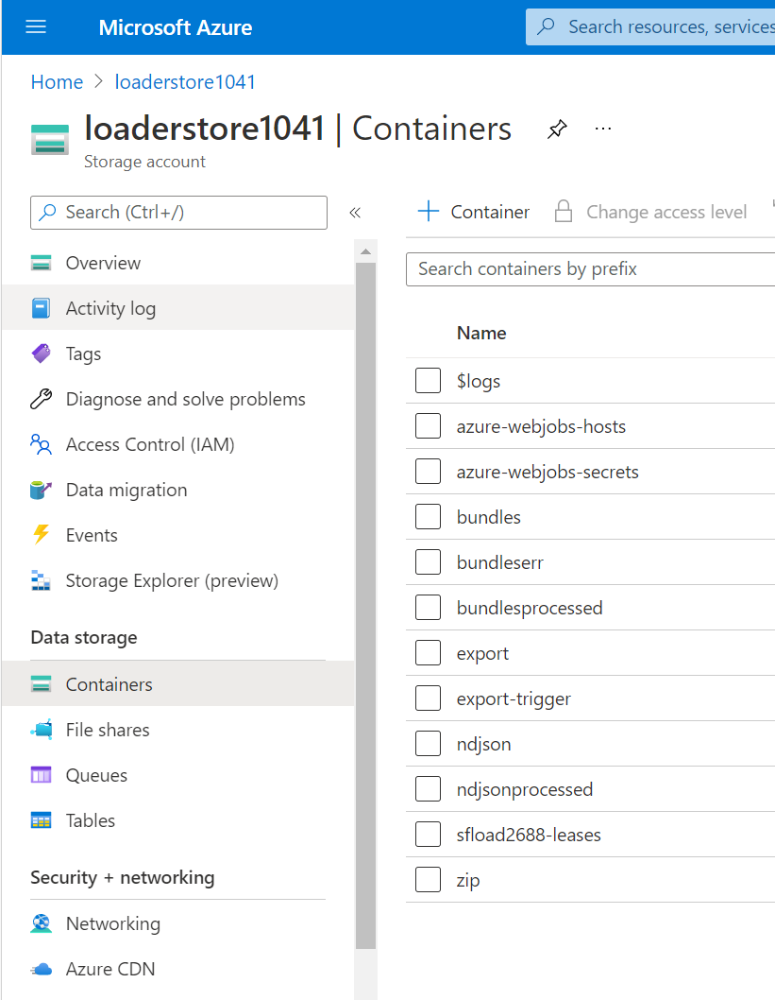
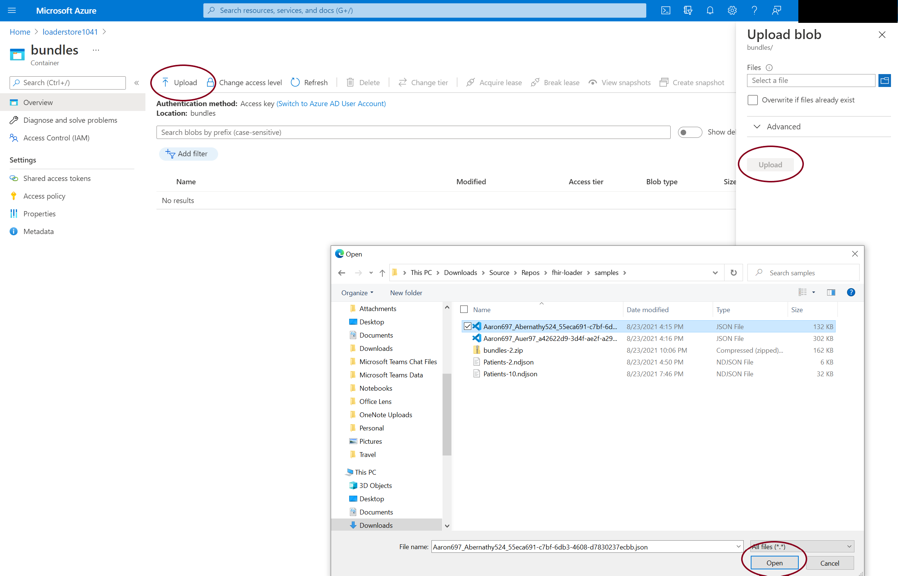
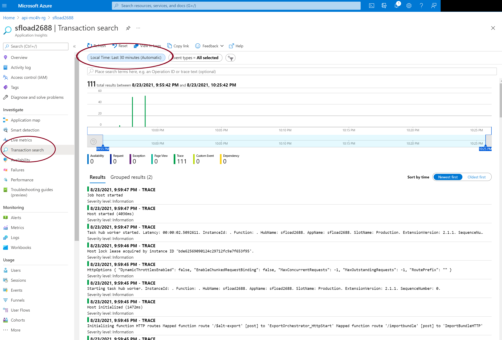

# Testing

## Description

This guide provides information on testing FHIR-Bulk Loader capabilities.

## What to focus on

We remain diligently focused on security and performance. As we introduce new features, there may be times where changes may impact functionality and / or performance. The tests below are focused on functionality. Please see the [performance](./performance.md) documentation for questions on performance.  

## What if I find an issue?

You may open an [issue](https://github.com/microsoft/fhir-loader/issues) against the Github repository. We actively triage these and will work on resolving whatever you may find.

## Testing

### File Preparation 
The FHIR-Bulk Loader will process files in several formats: 
- _Bundles_ - A bundle is a collection of FHIR resources placed into a single file with a containing context.  
- _NDJSON_ - _a.k.a_ Newline delimited JSON, is a format for storing structured data that may be processed one record at a time.
- _Zip_ - Compressed FHIR bundles (.zip format) allow users to move large amounts of files efficienly through the Azure network.

Sample [Synthea](https://github.com/synthetichealth/synthea) files are avilable for testing in the [samples directory](https://github.com/microsoft/fhir-loader/samples).

1) Download the Sample Synthea files from above to your hard drive. These files can be downloaded from GitHub or your Azure CLI Environment.  _Downloading from the CLI environment is the most reliable method._

2) Using the Storage name from the Deployment, upload the sample files into the appropriate Blob Container: 
 - .zip files into the .zip container
 - ndjson files into the ndjson container 
 - individual bundles into the bundles container

3) Once the file is uploaded, it will be processed and moved into a _filetype_processed or _filetype_error container. These files contain tracking and/or error messages.  

4) Files can also be tracked through the Function Loader Application Insights deployment (via the installation script).

Go To -> _loadername_ Application Insights (Function App name will start with sfload + _randomnumber_ or end with an "ldrfa" suffix).

Then -> Transaction Search
Set Local Time to Last 30 minutes 
Review Trace data 

## Next steps

To learn how to access the FHIR API using Postman, you can take a look at the [Postman tutorial](https://docs.microsoft.com/en-us/azure/healthcare-apis/access-fhir-postman-tutorial) on the Azure Docs site.

You can use Postman to test the FHIR server. https://github.com/microsoft/fhir-server/blob/main/docs/PostmanTesting.md

Finally Postman files are available for download at https://github.com/daemel/fhir-postman or https://github.com/microsoft/health-architectures/blob/main/Postman/README.md.

## Disclaimer

- There may be factors outside our normal schedule that cause releases to happen more or less frequently. These might include hotfixes, technical issues, or other circumstances not mentioned.
- There are other closed-source projects and integrations that make this project possible.
