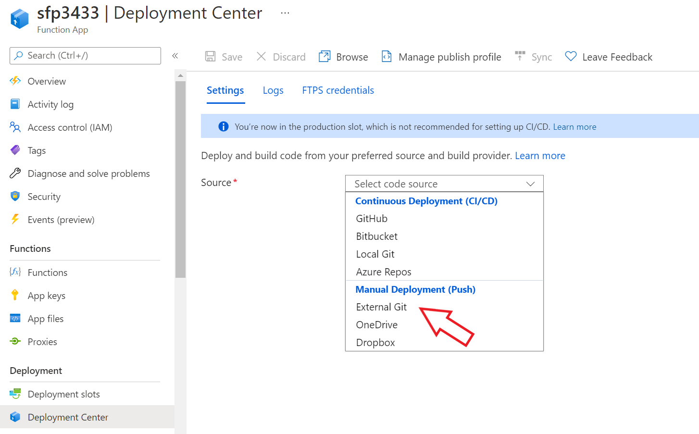

# Updating FHIR Loader 

By default the FHIR-Loader function stays in sync with updates posted in the Github Repo https://github.com/microsoft/fhir-loader, as new features are added customers will automatically receive them unless they disabled deployment sync or they are operating on a closed network without external access.  

## Default Deployment 
By default FHIR Loader 

## Editing Deployment Center setup 
If the Deployment Center setup does match the default deployment, it can be changed as follows.

1. Disconnect the existing connection 

2.  Select External Git

3.  Complete the form using the proper repo (proxy in this example) _https://github.com/microsoft/fhir-proxy_, __main__ and __Public__ repo then select __Save__.  

4.  Validate the deployment success via the Logs 

## Private Link Function Deployment
There are multiple methods to updating Azure Functions, for security reasons though a deployment process must be used.  

[Zip Deply](https://docs.microsoft.com/en-us/azure/azure-functions/functions-deployment-technologies#zip-deploy)
Zip deploy is the recommended deployment technology for Azure Functions. 

Use zip deploy to push a .zip file that contains your function app to Azure. Optionally, you can set your app to start running from package, or specify that a remote build occurs.

[Continuous Deployment](https://docs.microsoft.com/en-us/azure/azure-functions/functions-continuous-deployment)
With Private Networks, the repo source must be accessible to the private network 
