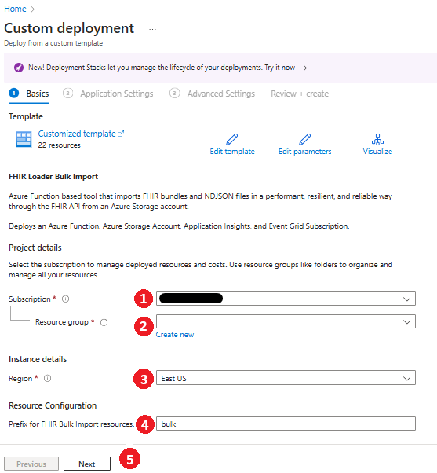
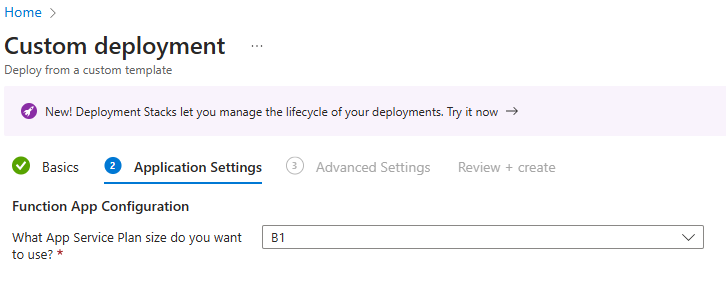
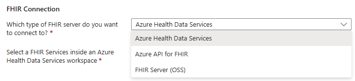
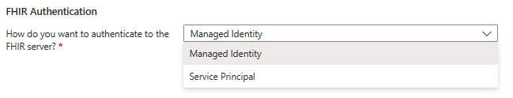
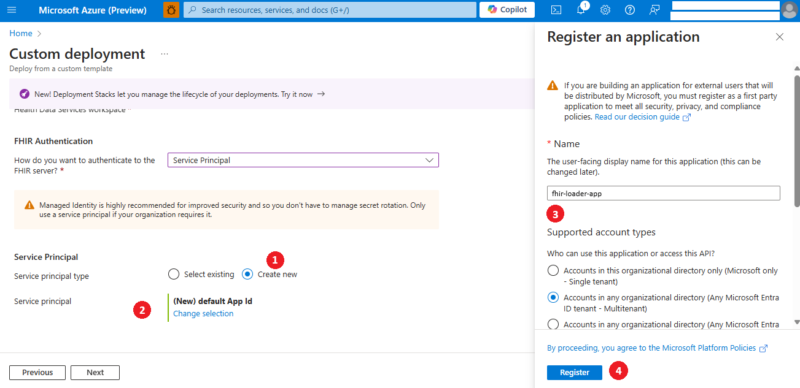
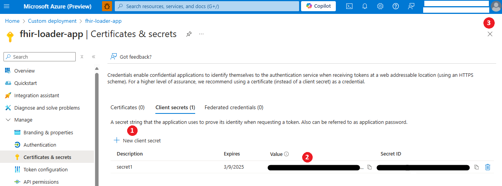
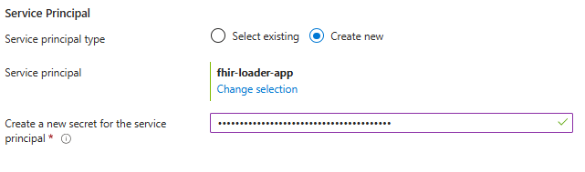
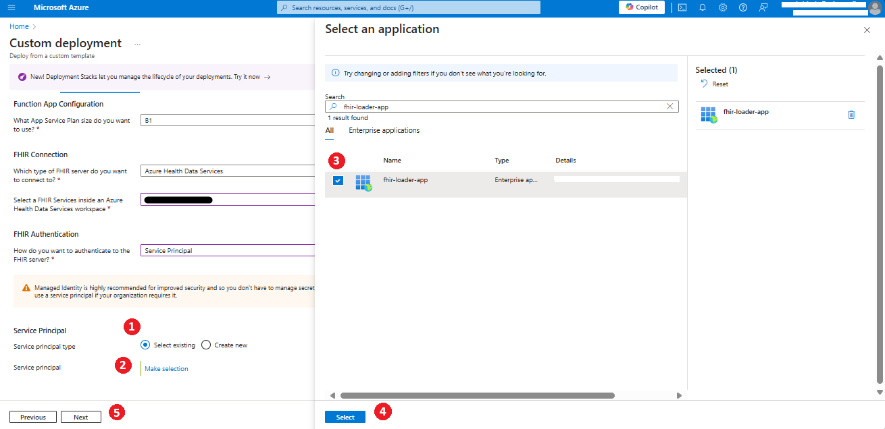
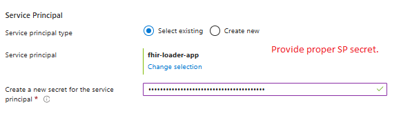
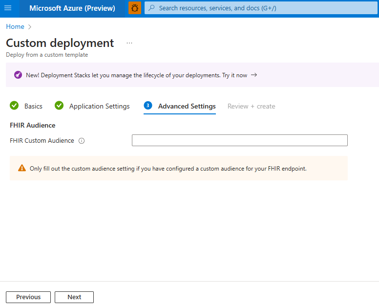

## Deploy FHIR Loader using Azure Portal

### 1. Basic Configuration

1. Select the subscription in which you want to deploy the FHIR Loader.
1. Either select an existing Resource Group that contains the Azure API for FHIR, Azure Health Data Services FHIR service, or OSS FHIR Server, or create a new Resource Group.

    *Note- If you are using MSI for authentication, the API for FHIR or Azure Health Data Services needs to be in the same Resource Group.*
1. Select the region where you intend to deploy the FHIR Loader.
1. The `bulk` prefix will be appended by default to all resources deployed with the sample. If needed, replace `bulk` with any other prefix of your choice.  
1. Click on `Next`.

### 2. Function App Configuration

1. Select the App Service Plan size based on your requirements.

### 3. FHIR Connection

1. Select the type of FHIR server you want to use with the FHIR Loader.
1. If you selected API for FHIR or Azure Health Data Services, choose the existing API for FHIR resource or FHIR Service accordingly.
1. If you selected FHIR Server (OSS), provide the FHIR Server (OSS) URL. You can find this URL in the Web App deployed for the FHIR Server (OSS). 

### 4. FHIR Authentication

1. Choose the authentication method to be used.
1. If you select Managed Identity, click `Next`.
1. If you select Service Principal, follow the steps below:

    *Note- If you select Service Principal, you need to create or have a Service Principal and generate a Client Secret for it.*

### 5. Service Principal Configuration
If you have an existing Service Principal, you can choose `Select existing`. Alternatively, choose `Create new` to create a new Service Principal. 

*Note- You need to follow one of the steps below.*

#### A. Create New Service Principal

1. Choose `Create new` to create a new Service Principal.
1. Click on `Change Selection`.
1. Enter name of the Service Principal you wish to create.
1. Click `Register`. You will be redirected to the Certificates & Secrets section of your newly created Service Principal.

1. Click on `New client secret`.
1. Create a new client secret by providing name.
1. Copy the secret for use in subsequent steps.
1. Close the current section.

1. Paste the previously copied secret here.
1. Click on `Next`.

#### B. Use Existing Service Principal

1. If you have an existing Service Principal, select `Select existing`.
1. Click on `Make Selection`.
1. Search for the existing Service Principal using either the name or Application Client ID.
1. Select the existing Service Principal.
1. Click on `Select`.

1. Provide a new or old(not expired) secret for the existing Service Principal.
1. Click on `Next`.

### 6. FHIR Audience

1. If you have configured a custom audience for your FHIR endpoint, provide the same custom audience here. Otherwise, you can leave it blank.
1. Click on `Next`.

### 7. Review + Create
1. Review all the inputs you provided in the previous steps.
1. Click on `Create`.