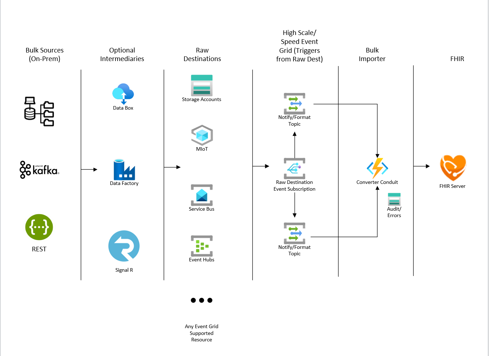
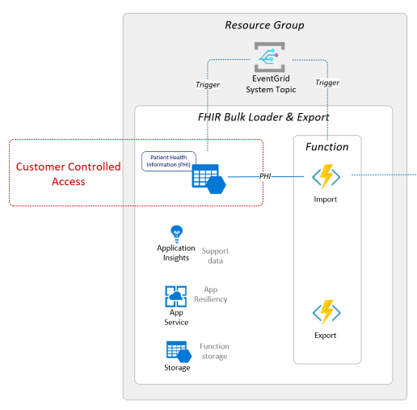

# FHIR-Bulk Loader & Export

## Introduction 

**FHIR-Bulk Loader & Export** is an Azure Function App solution that provides the following services for ingesting and exporting FHIR data:
 + Imports FHIR Bundles (compressed and non-compressed) and NDJSON files into a FHIR service 
 + High Speed Parallel Event Grid that triggers from storage accounts or other event grid resources
 + Complete Auditing, Error logging and Retry for throttled transactions
 + High Speed Parallel Orchestrated Patient-centric Export Capability 

## Architecture Overview


## Prerequsites
1. The FHIR-Bulk Loader & Export requires the following components: 
   + Azure API for FHIR, Azure Health Data Services FHIR service, or OSS FHIR Server
   + *Optional* FHIR-Proxy (with Key Vault)

2. You must have at least a Contributor role in your Azure subscription so that you can create/update the following resources:
   + Resource Group
   + Storage Account 
   + App Service Plan 
   + Function App 
   + Event Grid

3. You must be assigned a Key Vault access policy to read/write secrets in the specified Key Vault.

## Deployed Components
_Larger image [here](./docs/images/architecture/install-components.png)_



## Deployment
1. [Open Azure Cloud Shell](https://shell.azure.com) - you can also access this from [Azure Portal](https://portal.azure.com)
2. Select Bash Shell for the environment 
3. Clone this repo
```azurecli
git clone https://github.com/microsoft/fhir-loader.git
```
4. Execute ```deployFhirBulk.bash``` for direct FHIR Server access or ```deployFhirBulk.bash -o proxy``` to use FHIR Proxy access.

Detailed instructions can be found [here](./scripts/Readme.md).

## Importing FHIR Data
Once deployment is complete, go to the storage account created for the FHIR-Bulk Loader and Export and click on the **Storage browser (preview)** blade.


The containers for importing data are created during deployment. A different container is created for each input file type.
- for FHIR Bundles (transactional or batch), use the "bundles" container
- for NDJSON formated FHIR Bundles, use the "ndjson" container
- for Compressed (.zip) formatted FHIR Bundles, use the "zip" container

Simply upload the file for import into the proper container, and FHIR-Bulk Loader will automatically add the data to the FHIR service database.

## Exporting Bulk Patient-centric FHIR Data
The FHIR-Bulk Loader and Export also provides an endpoint to execute a high speed parallel patient-centric bulk export of data. It is similar to the capabilities provided by the built-in FHIR Server `$export` function but uses multiple connections to invoke FHIR API calls with user-defined criteria and standard FHIR Query parameters. This can offer performance advantages and more precise resource inclusion than the $export operation specified in the FHIR standard. The data for your export is written to the ```export``` container of the storage account created with the fhir-loader installation. Each export job creates it's own subcontainer using the ```instanceid``` of the triggered export job.

## Defining a query definition object
This is a JSON Object that defines the targeted export resources in the system. You will POST this object to the orchestration endpoint to begin the bulk export process. The query JSON Object format is:</br>
 ```
{
	"query": "<Resource Query>",
	"patientreferencefield":"<The root element of the resource that contains the correlating Patient>",
	"include": [
	<Individual Resource include queries using $IDS to substitute patient references> 
	]
}
```
### Example 1:</br>
As a payor you need subscriber data for a CMS data exchange. You want to export certain resources for subscribers of a particular coverage class. The class value is Med1 and you want all of the matched subscribers with the Patient, Coverage, ExplanationOfBenefit, Condition, Observation, AllergyIntolerance, and Encounter resources included. For this you could use the following query definition object:</br>
```
{​​​​​
	"query": "Coverage?class-value=Med1&_count=50",
	"patientreferencefield":"subscriber",
	"include": [
		"Patient?_id=$IDS&_count=50",
		"Coverage?patient=$IDS&_count=50",
		"ExplanationOfBenefit?patient=$IDS&_count=50",
		"Condition?patient=$IDS&_count=50",
		"Observation?patient=$IDS&_count=50",
		"AllergyIntolerance?patient=$IDS&_count=50",
		"Encounter?patient=$IDS&_count=50"
	]

}​​​​​
```
Note: the ```patientreferencefield``` is ```subscriber```. This contains the logical id reference to the patient on the Coverage resource. As the system processes the included resources of the query field, the value is substituted in the $IDS query parameter that points to the correlated patient reference. The ```_count``` parameter optimizes the number of resources processed at a time. If the recommendation is 50 or less. Anything greater than 50 is not recommended and could generate illegal query strings. If the ```_count``` parameter is not included, the default page size of the FHIR server is used.</br>
### </br>Example 2:</br>
As a provider you want to export data for your patient population – specifically those born before 1951 for import into a wellness campaign system. You are only interested in data contained in the Patient and Encounter resources. You would use the following query definition object:
```
{
	"query": "Patient?birthdate=lt1951-01-01&_count=50",
	"patientreferencefield":"id",
	"include": [
		"Encounter?patient=$IDS&_count=50",
		"Patient?_id=$IDS&_count=50"
	]
}
```
## Requesting an alternative patient export
1. Create your query definition object to target the data you wish to export using the instructions above.
2. Obtain the function URL and key generated during the installation of the FHIR-Bulk Loader.
3. Using an HTTP client, POST the query definition object in the HTTP Body to the following endpoint:</br>```https://<your function url>/$alt-export?code=<your function access key>```
4. The system will asynchronously schedule your export and return the following control/information JSON object:</br>
```
{
	"id": "<instanceid that identifies your export job in the system>",
	"statusQueryGetUri": "<use HTTP GET to this URL to check status of your export job>",
	"sendEventPostUri": "<currently not supported in export function>",
	"terminatePostUri": "<use HTTP POST to this URL to terminate your export job>",
	"purgeHistoryDeleteUri": "<use HTTP POST to this URL to purge all run history artifacts for this export job>",
	"restartPostUri": "<do not use...restarts are not supported or recommended>"
}
```
## Export Job Results
You can view the results of an export job using either the status query get uri or, upon completion of the export job, a text file is written in the export job container called ```_completed_run.xjson```. Both of these contain a JSON object with the results of your export job. The ```output``` field of the JSON is compliant with the FHIR Export specification and contains file location and resource counts:</br>
```
...
"output": [
            {
                "type": "Observation",
                "url": "https://<your export storage account container url>/Observation-1.xndjson",
                "count": 2860,
                "sizebytes": 2587680,
                "commitedblocks": 62
            },
            {
                "type": "Encounter",
                "url": "https://<your export storage account container url>/Encounter-1.xndjson",
                "count": 6381,
                "sizebytes": 9231348,
                "commitedblocks": 136
            },
...
]
```

## Performance 
The FHIR-Bulk Loader deploys with a Standard App Service plan that can support tens of thousands of file imports per hour. During testing we have been able to scale the FHIR-Bulk Loader performance to hundreds of thousands of files per hour.  

**Note:** Scaling to hundreds of thousands of files per hour requires additional scaling on the FHIR API to handle the incoming messages. High rates of 429's at the API or Cosmos data plane indicate that additional scaling is necessary. 

Detailed performance guidelines can be found [here](docs/performance.md). 

---

# Contributing

This project welcomes contributions and suggestions.  Most contributions require you to agree to a
Contributor License Agreement (CLA) declaring that you have the right to, and actually do, grant us
the rights to use your contribution. For details, visit https://cla.opensource.microsoft.com.

When you submit a pull request, a CLA bot will automatically determine whether you need to provide
a CLA and decorate the PR appropriately (e.g., status check, comment). Simply follow the instructions
provided by the bot. You will only need to do this once across all repos using our CLA.

This project has adopted the [Microsoft Open Source Code of Conduct](https://opensource.microsoft.com/codeofconduct/).
For more information see the [Code of Conduct FAQ](https://opensource.microsoft.com/codeofconduct/faq/) or
contact [opencode@microsoft.com](mailto:opencode@microsoft.com) with any additional questions or comments.

FHIR is the registered trademark of HL7 and is used with the permission of HL7.
